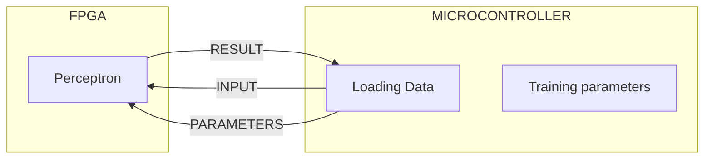

# FPGA-perceptron-
This repository is an investigation into how custom hardware may be able to improve the performance of neural networks. To this end, a restricted scenario has been constructed to give an environment in which a proof of concept can be created. The principle idea is that designing a custom arithmetic logic unit on an FPGA will allow the FPGA to function as the core internals of a perceptron, while the training of the parameters of the perceptron is handled by an external device, such as a microcontroller.
                    
                        


#Project limitations
To reduce the complexity of the project, so that a prototype can be produced within a reasonable amount of time, some limitations have been placed on the project. 


#How to run
python version 3.12.0

python testing framework: cocotb

VHDL simulation: NVC

VHDL development environment GOWIN


## Eight bit perceptron theory

The current implementation of the perceptron adheres to a few limitations:
- The system will limited to eight bit unsigned integer values.
- Multiplication will be replaced with bit shifting.
- The activation function used will be a simple threshold function


## Architecture

```text
          Input
            │
            ▼
     Barrel Shifter
            │
            ▼
       8-bit Adder
            │
            ▼
       Comparator
            │
            ▼
         Output
```


## Eight bit perceptron implementation

Currently the perceptron is made of two parts, a barrel shifter and an adder. These are used to replicate the input weight and neuron offset. The total design so far is as follows:


Currently the weights are hard coded, as well as the static value for the comparator. This will be improved in future entries.

## barrel shifter

The barrel shifter consists of three layers of left bit shifts that allow for the shifting of either 1, 2, or 4 bits individually, which allows for any 3 bit combination of left shift. Design as follows:


## Adder

The adder design is a standard simple eight bit adder, with the design following the same implementation as the following: 


## Comparitor

The comparator evaluates if the perceptron's value is greater than or equal to a statically defined value. It uses a primitive design that is easily improved to use fewer gates / LUTs.


