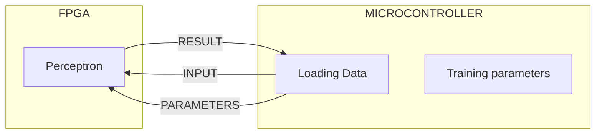

# FPGA-perceptron-
This repository is an investigation into how custom hardware may be able to improve the performance of neural networks. To this end, a restricted scenario has been constructed to give an environment in which a proof of concept can be created. The principle idea is that designing a custom arithmetic logic unit on an FPGA will allow the FPGA to function as the core internals of a perceptron, while the training of the parameters of the perceptron is handled by an external device, such as a microcontroller.
                    
                        


# Project limitations

To reduce the complexity of the project, so that a prototype can be produced within a reasonable amount of time, some limitations have been placed on the project. 

The current implementation of the perceptron adheres to a the following limitations:
- The system will limited to eight bit unsigned integer values.
- Multiplication will be replaced with bit shifting.
- The activation function used will be a simple threshold function


# How to run

The VHDL is written in the GOWIN VHDL development environment.

The VHDL tests are written in python and can be run using the following:

- python version 3.12.0
- python testing framework: cocotb
- VHDL simulation: NVC

VHDL is written to a Tang nano 9k.

Hardware testing is done using the "testbench.ino" Arduino file running on an adafruit ESP32 feather V2.


# Data transfer and control 

The FPGA receives the following inputs:
- source [7:0]
- selector [1:0]
- write [0]

The source data line is how the inputs for forward propagation and how new parameters are transferred to update them. The distinction between forward propagation and parameter updating is controlled via the selector inputs. The selector pins are encoded as follows:
- 00 - forward propagation 
- 01 - update the weight
- 10 - update the bias
- 11 - update the threshold 

The write input is used an external clock for selecting the different modes and updating the registers that contain the values of weight, bias, and threshold. Updates are performed on the rising side of the clock cycle. 

The FPGA produces the following output:
- sink [0]

The sink output is a binary output representing the outcome of the activation function.


To perform forward propagation the selector pins have to be set to 00, then one clock cycle is be performed via the write pin. After this, no clock cycles are needed and any data that is written to the source input is immediately processed and returned via the sink output. Any number of data points can be sent through without needing to change the selector pins or providing a new clock cycle.

For all variable updates, the process is the same just with different selector pins being active. The process is as follows:
- Set selector pins
- perform one clock cycle
- Set the source data
- perform one clock cycle

## Architecture

```text
         Source ━━━━━━━━━━━━━━━━━━┓
            │                     ┃
            ▼                     ┃
     Barrel Shifter ◀━━ Weight ◀━┫
            │                     ┃
            ▼                     ┃
       8-bit Adder  ◀━━ Bias ◀━━━┫ 
            │                     ┃
            ▼                     ┃
       Comparator ◀━━ Threshold ◀┛
            │
            ▼
           Sink
```

# Eight bit perceptron theory

A typical perceptron using a threshold activation function operates according to:

```math
y =
\begin{cases}
1 & \text{if }  wx+b \geq T \\
0 & \text{if }  wx+b < T
\end{cases}
```

where:

y - perceptron output

x - perceptron input

w - perceptron weight

b - perceptron bias

T - the threshold of the activation function

and:

```math
wx = w×x
```

This prototype functions slightly differently by replacing the multiplication of the input and weight with a left bit shift.

```math
wx → w << x

```
```math
wx≈x×2^w
```

Furthermore, this prototype uses 8 bit unsigned integers for the input data, bias, and threshold. A 3 bit unsigned integer is used for the weight.  

# Eight bit perceptron implementation

The perceptron is made of three main parts, a barrel shifter, an adder, and a comparator, which are used to replicate the input weight, neuron bias, and activation function. These components use variables stored in registers and occur sequentially. 


## barrel shifter

The barrel shifter consists of three layers of left bit shifts that allow for the shifting of either 1, 2, or 4 bits individually, which allows for any 3 bit combination of left shift. Design as follows:


## Adder

The adder design is a standard simple eight bit adder, with the design following the same implementation as the following: 


## Comparator

The comparator evaluates if the perceptron's value is greater than or equal to a the value stored in the associated register. 


# performance testing 

All tests are the average of 1000 samples.

| test | Description | time in microseconds |
| --- | --- | --- |
| update weight | This test measures how long it takes to update the weight | 9.26 |
| update bias | This test measures how long it takes to update the bias | 9.41 |
| update threshold | This test measures how long it takes to update the threshold | 9.31 |
| single forward prop | This test measures how long it takes to switch to forward propagation and perform one pass | 8.22 |
| pre selected forward prop | This test measures how long it takes to perform one forward pass, assuming that forward propagation has already been selected | 6.20 |


